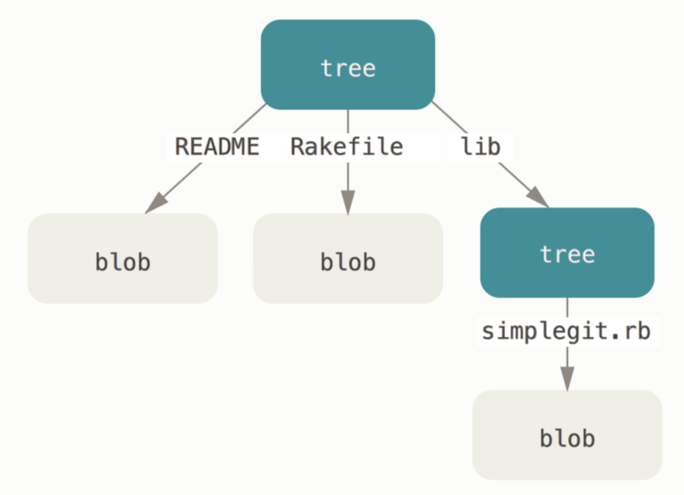
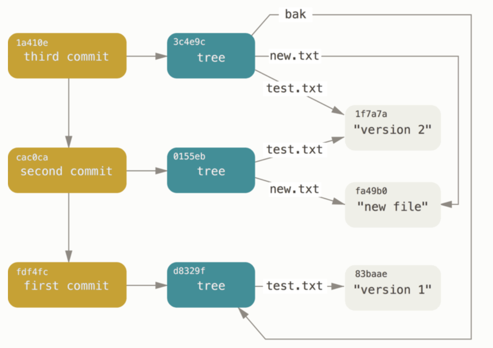

# git

- [git](#git)
  - [버전관리 시스템은 왜 나오게 되었을까요?](#버전관리-시스템은-왜-나오게-되었을까요)
  - [git 은 어떤 버전관리 시스템?](#git-은-어떤-버전관리-시스템)
  - [git과 GitHub](#git과-github)
  - [git 의 명령어들](#git-의-명령어들)
    - [외에도 유용한 명령어들](#외에도-유용한-명령어들)
  - [git Object?](#git-object)
    - [blob object](#blob-object)
    - [tree object](#tree-object)
    - [commit object](#commit-object)
    - [other object](#other-object)
  - [HEAD](#head)
  - [Tag](#tag)
  - [Branch](#branch)
  - [히스토리 저장방법](#히스토리-저장방법)
  - [리모트 git 저장소에 원하지 않는 파일이 올라갔을 때](#리모트-git-저장소에-원하지-않는-파일이-올라갔을-때)
    - [해결방법](#해결방법)

## 버전관리 시스템은 왜 나오게 되었을까요?

- FTP 같은 프로토콜을 이용하여 서버에 올려서 파일을 주고받는 게 너무 불편해서

## git 은 어떤 버전관리 시스템?

- 분산형 형상관리 시스템
  - 개발자들이 서로의 코드에 맞추는데 시간을 보내기 보다는 구현에 집중하기 위해서
- `content-addressable filesystem` == simple key-value data base

## git과 GitHub

- git 은 version control system
- 깃허브는 드라이브 같은 원격저장소 + 커뮤니티

## git 의 명령어들

- `clone`: remote -> local
- `add`: `index` update == staging
  - `index`: working tree contents 와 next commit contents 의 snapshot
- `commit`
  - records who, when, why
- `push`: local -> remote
- `pull`: `git fetch + git [merge||rebase]`
  - remote -> local
- `branch` - create or delete branch
  - 현실에서 create 시에는 `git checkout -b [branch-name]` 을 사용하여 switching 까지 동시에 한다.
- `stash`: staging 된 이력들을 임시저장

### 외에도 유용한 명령어들

- `git reset`
- `git status`
- `git log`
- `git checkout`

## git Object?

> [git internals and obejcts](https://git-scm.com/book/en/v2/Git-Internals-Git-Objects)

- the data in the database in `.git/objects/`
  - take a look via command `git hash-object`
- hashed(SHA1) map
- all contents stored as `blob` or `tree` object
- unix system based

### blob object

- [inodes](https://en.wikipedia.org/wiki/Inode) or file contents

### tree object

> `git cat-file -p master^{tree}`

- a tree object holds `entry/entries`
  - UNIX directory entries
  - `entry`: SHA-1 hash of a blob or subtree
  - holds `mode`, `type`, `filename`
    - `type`
      - blob or what?
      - `git cat-file -t`
    - `mode`
      - modified? untracked? deleted?
    - `filename`: sample.txt

### commit object

- `who` saved the snapshots, `when` they were saved, or `why` they were saved.
  - `who`: `user.name + user.email`
  - `when`: timestamp
  - `why`: commit message

### other object

- Tag
  - `lightweight tag` != `git object`
    - `pointer to certain commit`
  - `annotated tag` == `git object`
    - checksummed
    - tagger name, email, and date
    - tagging message
    - can be GPG signed

## HEAD

- The pointer that indicates where you currently work on.
- `ref`
  - usually indicates branch
  - sometimes commits: `detatched head`

## Tag

> [basic of tagging](https://git-scm.com/book/en/v2/Git-Basics-Tagging)

- `git show`
- pointer or git object

## Branch

- `lines of development`
  - The main line or diverge from the main line of development and continue to do work without messing with that main line

## 히스토리 저장방법

- snapshot
- only reflects changed things

## 리모트 git 저장소에 원하지 않는 파일이 올라갔을 때

- youngwon: `git rm --cached file_to_remove.txt`
  - 로컬에서 indexing 된 걸 untracked로 바꿀 때는 유용하지만 이미 올라가있다면...?
- joo: `git revert or reset`
  - 리버트는 히스토리가 남고, 리셋을 한뒤에는..?
- tim: `git reset --hard` && `git push -f`
  - 다 날려버리는 좋은 방법이 될 수 있지만, 만약 다른 변경사항들과 섞여 있다면...?

### 해결방법

- 타 이력이 특별하지 않다면 `git reset --hard` 후 `git push`
- 타 이력이 중요하다면 `git reset --mixed` (option flag 없는 것이 곧 mixed)
  - 다음으로 `git rm --cached [target]`
  - 그리고 다시 `git commit` 후, `git push -f`

<Comment/>
